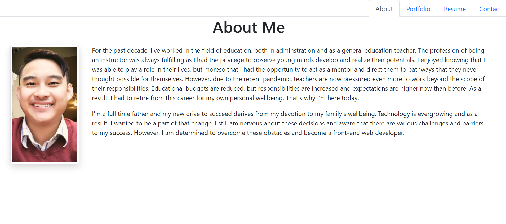

# DLuu React Portfolio

## Description

This is a simple portfolio create by React that allows users to review my biography, work portfolio, resume, and are able to contact me.
## [Look at it yourself!](https://maestroluu.github.io/dluu-react-portfolio/)

  

## Installation

There is no installation required for the utility of this portfolio.

## Usage

To view this app, please click on the link provided above and click on the different tabs to view the other pages.

## Technology

- [React](https://reactjs.org/) 

## Credits

I want to thank the following developers for providing feedback and review during the development of this application:  
- Github: [Marco Flores](https://github.com/JaggedComet/)
- Github: [Chris Muto](https://github.com/chrismuto)

## Questions

If you have any additional questions regarding this application, please contact me via the channels provided below: 
Github: https://github.com/MaestroLuu 
Email: DLuu.developer@gmail.com